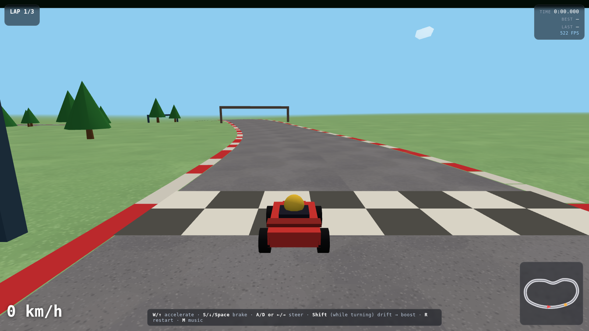
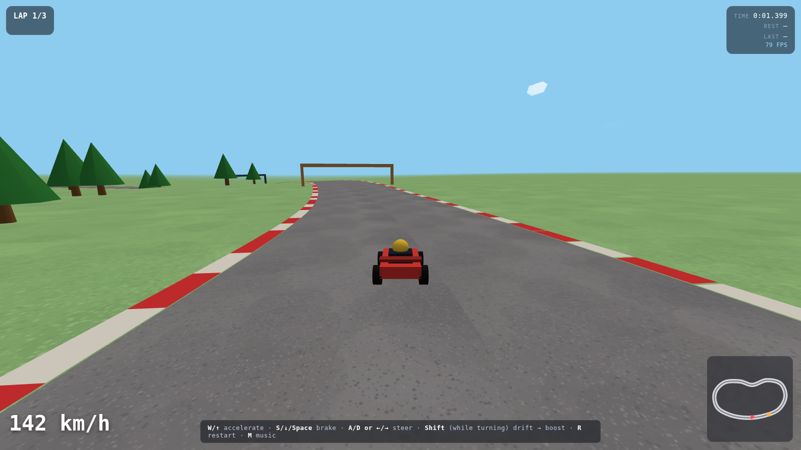
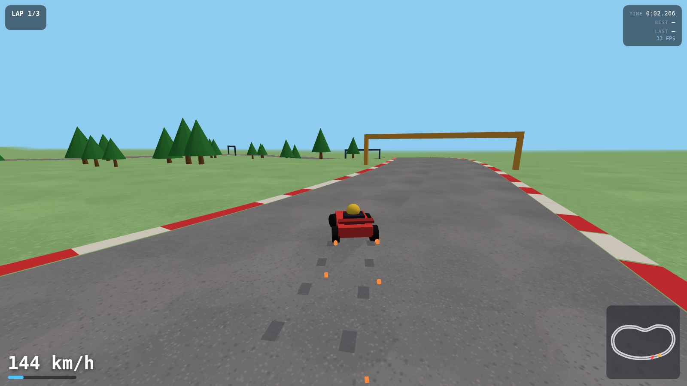

# Kart Circuit

A browser kart racer in the Mario-Kart-behind-the-driver mould: TypeScript, Three.js, a deterministic fixed-timestep arcade physics core, drift-and-boost, gentle elevation, and a ghost-free solo time-trial on a closed circuit. Everything renders in the browser window with the HUD as edge overlays.



## Quick Start

```bash
npm install
npm run dev
```

Open http://localhost:5173 — drive with **W/A/S/D** or arrows. Timer starts on first acceleration.

## Verify

```bash
npm test          # 79 unit + drivability tests (Vitest)
npm run build     # typecheck + production bundle
```

The test suite includes an autopilot that races the actual circuit in
simulation and asserts lap completion, on-track %, pace and steering calm —
see [docs/ARCHITECTURE.md](docs/ARCHITECTURE.md).

## Features

- **Solo time-trial** — 3 laps, checkpoint-ordered lap detection, best/last lap times



- **Drift + boost** — hold **Shift** while turning to slide; charge tiers fire a speed boost on release (gold = tier 2), with camera shake and engine pitch kick
- **Gentle elevation** — analytic hills: the road, kerbs, gates, trees and terrain all follow the same profile, and physics feels the grade (uphill slows you, downhill pulls)
- **Full-window gameplay** — HUD as translucent edge overlays (lap/time pills, speedometer, minimap with next-gate marker); controls hint fades away
- **Checkpoint gates + minimap** — pulsing arches show the next sector; minimap tracks kart heading
- **Procedural everything** — track spline, textures, kart, trees: zero art assets, instant load
- **Generated audio** — ElevenLabs one-shots and music loop (`npm run gen:audio`), plus synthesized engine hum pitched by speed; M mutes music
- **60 FPS target** — fixed 120 Hz simulation decoupled from render, InstancedMesh particles/trees, ~70 draw calls



## Controls

| Key | Action |
|---|---|
| W / ↑ | Accelerate |
| S / ↓ / Space | Brake, then reverse |
| A/D or ←/→ | Steer |
| Shift (while turning) | Drift → release for boost |
| R | Restart race |
| M | Mute/unmute music |

## Documentation

- [docs/USER_GUIDE.md](docs/USER_GUIDE.md) — driving guide, racing line notes, drift technique
- [docs/ARCHITECTURE.md](docs/ARCHITECTURE.md) — module map, TDD strategy, physics/elevation design

## Project Layout

```
src/game/    pure logic (fully unit-tested): kart physics, drift, track math,
             spline, elevation, race state, autopilot drivability test
src/render/  Three.js layer: scene, track/kart meshes, particles, tire marks,
             gates, minimap, clouds, procedural textures
src/audio.ts WebAudio engine (synth hum + generated one-shots)
src/input.ts keyboard state → controls
src/main.ts  wiring: fixed-timestep loop, HUD, effects
scripts/     gen-audio.mjs (ElevenLabs), screenshot.mjs (Playwright)
```

## License

MIT
